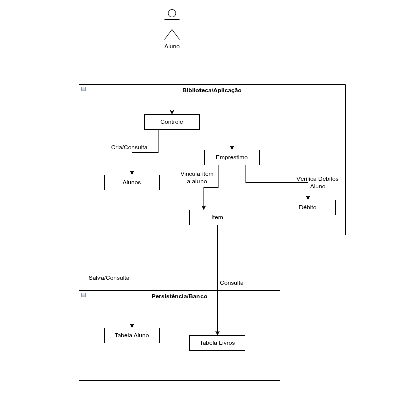

# Documentação de Arquitetura de Software: Sistema de Gerenciamento de Biblioteca

A arquitetura do Sistema de Gerenciamento de Biblioteca é descrita nessa documentação -sedetalhando sua estrutura conceitual, fluxo de dados e divisão de responsabilidades.

## 1. Visão Geral da Arquitetura

O sistema adota o padrão de arquitetura **MVC (Model-View-Controller)**, escolhida para garantir o  desacoplamento entre a camada de view, a lógica de negócios e a persistência de dados.

O mapeamento do domínio do problema e as regras de negócio iniciais estão caprensetadas na figura abaixo, secão 1.1.

### 1.1 Diagrama Conceitual do Domínio

---

## 2. Divisão de Camadas e Matriz de Responsabilidades

Para que o sistema seja coeso, as camadas lógicas são dividas em 3 e definidas:

### 2.1 Camada de Interação e Controle (Interface e Rotas)
*   **Ator (Aluno):** Agente  responsável por iniciar as requisições no sistema.
*   **`AlunoController`:** Componente de controle para as requisições HTTP da API. É responsável por receber os dados, realizar validações e coordenar a execução dos serviços de negócio.

### 2.2 Camada de Aplicação e Domínio (Regras de Negócio)
*   **`Aluno` (Model):** Entidade central do domínio contendo atributos e métodos, como por exexmplo: `verificaAluno()`.
*   **`Emprestimo`:** Componente responsável por ditar e aplicar as regras para locação de títulos literários, gerenciando os fluxos de checagem de pendências.
*   **`Item`:** Objeto associado que representa a instância de um livro vinculado temporariamente a um aluno após uma locação bem-sucedida.
*   **`Debito`:** Módulo especializado na verificação de restrições financeiras e pendências ativas do estudante.

### 2.3 Camada de Persistência (Acesso a Dados)
*   **`AlunoDAO` / Repositórios:** Componente de acesso a dados que abstrai a manipulação das bases físicas utilizando o framework **Spring Data JPA**.
*   **Bancos de Dados (`Tabela Aluno` / `Tabela Livros`):** Camada de armazenamento persistente onde os estados das entidades são consolidados.

---

## 3. Tecnologias Utilizadas

| Componente | Tecnologia / Framework | Função |
| :--- | :--- | :--- |
| **Backend** | Java / Spring Boot | Desenvolvimento de APIs e controle de fluxo |
| **Persistência** | Spring Data JPA / Hibernate | Mapeamento Objeto-Relacional (ORM) |
| **Modelagem** | UML Conceitual | Alinhamento de escopo e domínio |
